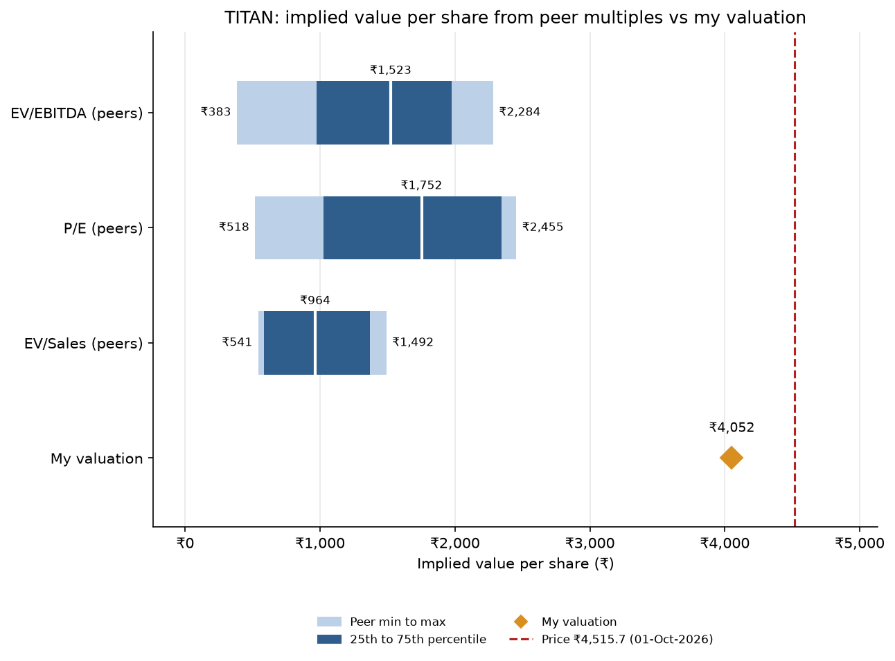

# Jewellery Peer Comps

[](https://github.com/Dakshcore/jewellery-peer-comps/actions/workflows/tests.yml)

A trading-comps tool for Titan Company and its listed Indian jewellery peers. It reads financials from Screener.in Excel exports and prices from NSE's bhavcopy (or from Screener), computes EV/EBITDA, P/E and EV/Sales for each company, and turns the peer range into an implied value per share for Titan, drawn as a football-field chart next to my own Titan valuation.

## Why comps, when I already have a valuation

My Titan valuation ([titan-valuation](https://github.com/Dakshcore/titan-valuation), a discounted-earnings model with an exit P/E) values the stock at ₹4,052 a share, against a price of ₹4,515.7 on 1 Oct 2026. That model says what the business is worth if my forecasts are right. Comps say what the market is paying today for similar businesses. They fail in different ways: a forecast-based model is only as good as its growth and margin assumptions, while comps inherit whatever mood the market is in. Putting both on one chart shows whether the gap between ₹4,052 and ₹4,515.7 is my forecasts being cautious or Titan simply trading at a premium to its peers.

## Results

Prices are Screener's "Current Price" on 1 Oct 2026 (the as-of date is set in `comps/config.py`). Fundamentals are the latest fiscal year (FY2026, March year-end), trailing, in ₹ crore. The core peers are Kalyan, Senco, Thangamayil and P N Gadgil; Trent is shown for reference and left out of the statistics.

| Company | Price (₹) | Mkt cap | EV | EV/Sales | EV/EBITDA | P/E | EBITDA margin | ROCE | Inventory days |
|---|---:|---:|---:|---:|---:|---:|---:|---:|---:|
| **Titan (target)** | 4,515.7 | 400,898 | 429,602 | 4.9x | 51.4x | 79.0x | 9.5% | 16.3% | 178 |
| Kalyan Jewellers | 528.5 | 54,581 | 59,837 | 1.7x | 23.4x | 40.4x | 7.2% | 17.2% | 145 |
| Senco Gold | 317.4 | 5,202 | 7,385 | 0.9x | 7.5x | 9.1x | 11.7% | 17.3% | 229 |
| Thangamayil (standalone) | 4,861.0 | 15,109 | 15,641 | 1.8x | 27.7x | 43.0x | 6.6% | 22.5% | 127 |
| P N Gadgil | 582.0 | 8,566 | 9,799 | 0.9x | 15.9x | 20.9x | 5.9% | 15.1% | 127 |
| *Trent (reference)* | 2,580.0 | 137,574 | 139,852 | 7.0x | 37.3x | 80.0x | 18.7% | 25.0% | 42 |

Core peer statistics (Titan and Trent excluded):

| Multiple | p25 | Median | p75 | Min | Max |
|---|---:|---:|---:|---:|---:|
| EV/EBITDA | 13.8x | 19.6x | 24.4x | 7.5x | 27.7x |
| P/E | 17.9x | 30.7x | 41.1x | 9.1x | 43.0x |
| EV/Sales | 0.9x | 1.3x | 1.7x | 0.9x | 1.8x |

Titan's implied value per share, applying those peer multiples to Titan's own numbers:

| Method | p25 | Median | p75 | Min to max |
|---|---:|---:|---:|---:|
| EV/EBITDA | ₹974 | ₹1,523 | ₹1,977 | ₹383 to ₹2,284 |
| P/E | ₹1,025 | ₹1,752 | ₹2,346 | ₹518 to ₹2,455 |
| EV/Sales | ₹585 | ₹964 | ₹1,369 | ₹541 to ₹1,492 |
| My valuation | | ₹4,052 | | |
| Price (1 Oct 2026) | | ₹4,515.7 | | |



On an LTM basis (`--basis ltm`, to Jun-26) the peer median EV/EBITDA is 18.8x, P/E 28.6x and EV/Sales 1.2x, and Titan's implied medians are ₹1,667, ₹1,857 and ₹920.

### Observations

- Titan trades at 51.4x EV/EBITDA and 79.0x P/E, about 2.6x the core-peer medians (19.6x and 30.7x). Among the jewellers only Thangamayil (27.7x, 43.0x) and Kalyan (23.4x, 40.4x) come anywhere near it, and Senco (7.5x, 9.1x) is far below.
- Titan's multiples sit closer to Trent's (37.3x EV/EBITDA, 80.0x P/E) than to the jewellers'. Trent has twice Titan's EBITDA margin (18.7% vs 9.5%) and about a quarter of its inventory days (42 vs 178).
- All three peer-multiple methods imply values well below the market price (medians ₹964 to ₹1,752 against ₹4,515.7), so the market is paying a premium that these peers' multiples do not explain. My own valuation of ₹4,052 is about 10% under the price.
- Profitability and returns do not separate Titan from the group: ROCE of 16.3% is inside the 15.1% to 22.5% peer range, and its EBITDA margin is above Kalyan, Thangamayil and P N Gadgil but below Senco. What does stand out is size (market cap about 4.8x the four core peers combined) and the highest EV/Sales (4.9x vs 0.9x to 1.8x).

### Caveats

- **Trailing multiples only.** There are no consensus forward estimates, and the peers are growing fast (FY26 sales growth of 33% to 73%), which flatters trailing multiples for the faster growers.
- **Thangamayil is standalone** (no consolidated page on Screener); the other five are consolidated.
- **Net debt is unadjusted.** It is Screener's Borrowings less Cash & Bank, so gold loans and lease liabilities likely sit inside it and investments are ignored. Titan's borrowings are ₹30,621 cr against cash of ₹1,917 cr, about 3.4x EBITDA, so EV-based multiples are sensitive to this.
- **Small sample.** Four core peers make the percentiles coarse, and one peer (Senco) pulls the lower quartile down.
- **One day's prices.** The as-of date (1 Oct 2026) is a config setting, not read from the exports.

Full write-up: `outputs/RESULTS.md` (generated locally, not committed). Analysis only, not investment advice.

## What's inside

| Module | What it does |
|---|---|
| `comps/screener.py` | Reads a Screener "Export to Excel" workbook by section and row label into a dataclass |
| `comps/bhavcopy.py` | Reads close prices (series EQ) from NSE's capital-market bhavcopy, `.csv` or `.zip` |
| `comps/metrics.py` | EBITDA, EBIT, net debt, market cap, EV, multiples, growth, margins, ROCE, ROE, inventory days; fiscal year and LTM |
| `comps/valuation.py` | Peer min / 25th / median / 75th / max and the implied value per share for the target |
| `comps/charts.py` | The football-field chart (PNG) |
| `comps/excel.py` | `outputs/comps.xlsx`: Comps table, Implied values, Inputs & as-of dates, Notes |
| `comps/config.py` | Peer groups, my valuation, reference price and the method notes |
| `comps/__main__.py` | The command line |

## Quick start

```bash
git clone https://github.com/Dakshcore/jewellery-peer-comps.git
cd jewellery-peer-comps
pip install -r requirements.txt
# put the downloaded files in data/raw/screener/ (see below), then:
python -m comps --target TITAN --price-source screener
python -m comps --target TITAN --price-source bhavcopy --bhavcopy data/raw/BhavCopy_NSE_CM_0_0_0_20260925_F_0000.csv.zip
python -m unittest -v
```

Other options: `--valuation 4052` (my valuation per share), `--ref-price 4515.7` and `--ref-date 1-Oct-2026` (the price line), `--basis ltm` (multiples on the last twelve months instead of the latest fiscal year), `--peers A,B,C`, `--reference TRENT`, `--include-reference` (put the reference peers into the medians), `--data-dir`, `--out-dir`. Outputs go to `outputs/`: `comps.xlsx` and `football_field.png`.

Written for Python 3.13 with NumPy, pandas, openpyxl and Matplotlib (see `requirements.txt`).

## Getting the data (by hand)

Nothing is scraped. Both inputs are files you download yourself, and `data/raw/` is git-ignored.

1. **Screener.in:** for each company, open its page, click "Export to Excel", and save the file as `data/raw/screener/<NSE_SYMBOL>.xlsx` (`TITAN.xlsx`, `KALYANKJIL.xlsx`, `SENCO.xlsx`, `THANGAMAYL.xlsx`, `PNGJL.xlsx`, `TRENT.xlsx`). Use the consolidated page where there is one.
2. **NSE bhavcopy (optional):** download the capital-market bhavcopy for the day you want (`BhavCopy_NSE_CM_0_0_0_YYYYMMDD_F_0000.csv.zip`) and pass it with `--bhavcopy`. Without it, prices come from the "Current Price" in each Screener export, which is the price on the day you downloaded it.

More detail: [docs/DATA_GUIDE.md](docs/DATA_GUIDE.md). Plan and note template: [docs/WEEK_PLAN.md](docs/WEEK_PLAN.md), [docs/NOTE_TEMPLATE.md](docs/NOTE_TEMPLATE.md).

**The Screener layout is undocumented.** The loader assumes the "Data Sheet" has section header rows (META, PROFIT & LOSS, Quarters, BALANCE SHEET, CASH FLOW, PRICE) and a "Report Date" row of dates in each time-series section, and it finds every row by its label inside its section, ignoring case and spacing. If a label is missing it stops and names it, so a layout surprise shows up as a clear error rather than a wrong number. Share counts are accepted in absolute numbers or crore: anything at or above 100,000 is divided by 10,000,000.

## Peer set

| Symbol | Company | Role | Screener basis |
|---|---|---|---|
| TITAN | Titan Company | Target | consolidated |
| KALYANKJIL | Kalyan Jewellers India | Core peer | consolidated |
| SENCO | Senco Gold | Core peer | consolidated |
| THANGAMAYL | Thangamayil Jewellery | Core peer | standalone (Screener has no consolidated page) |
| PNGJL | P N Gadgil Jewellers | Core peer | consolidated |
| TRENT | Trent | Reference: lifestyle retail, shown separately, not in the medians | consolidated |

All six are listed on NSE with these symbols and have a March fiscal year-end. Edit `comps/config.py` to change the set.

## Method

- **EBITDA** = Profit before tax + Interest + Depreciation − Other income. **EBIT** = EBITDA − Depreciation.
- **Net debt** = Borrowings − Cash & Bank, from the latest fiscal-year balance sheet. **Market cap** = price × shares in crore. **EV** = market cap + net debt. Money is in ₹ crore.
- **Multiples:** EV/Sales, EV/EBITDA and P/E (market cap / net profit), on the latest fiscal year or, with `--basis ltm`, on the last twelve months. A multiple with a zero or negative denominator is shown as n/a rather than a misleading number.
- **LTM** = the sum of the last 4 consecutive quarters in Screener's Quarters block, for Sales, EBITDA (same formula) and Net profit. If fewer than 4 consecutive quarters are available, LTM is n/a. LTM multiples still use the latest fiscal-year net debt.
- **Also computed:** revenue and EBITDA growth (1 year and 3-year CAGR), EBITDA and net margin, ROCE = EBIT / (Equity share capital + Reserves + Borrowings), ROE = Net profit / (Equity share capital + Reserves), and inventory days = Inventory / Sales × 365, which matters for jewellers because gold stock is most of their balance sheet.
- **Peer tiers:** the core jewellers set the medians. Trent is shown separately and left out of the statistics unless `--include-reference` is passed.
- **Peer statistics:** minimum, 25th percentile, median, 75th percentile and maximum, using linear interpolation.
- **Implied value per share:** for an EV multiple, (multiple × Titan's metric − Titan's net debt) / shares. For P/E, multiple × Titan's net profit / shares. The chart shows the 25th to 75th percentile as a dark bar, the minimum to maximum as a light bar, my own valuation as a diamond and the reference price as a dashed line.

## Limitations

- **Trailing multiples only.** There is no free source of consensus estimates, so nothing here is forward-looking. A fast-growing company looks expensive on trailing numbers.
- **Leases and gold loans sit in debt.** Screener's Borrowings may include lease liabilities, and jewellers can carry gold metal loans in borrowings. Net debt is not adjusted for either, so EV is not perfectly comparable across companies. Cash & Bank excludes investments.
- **Fiscal-year timing.** The balance sheet is at the last fiscal year-end but the price is today's. The LTM basis reduces the mismatch for earnings, not for net debt.
- **A small peer set.** Four core peers make the percentiles coarse, and the peers are smaller and differently run from Titan (Titan also has watches, eyecare and other businesses with different economics). One outlier moves the median.
- **Screener data is taken as given.** Standalone versus consolidated bases differ across companies (Thangamayil is standalone), and exceptional items are not stripped out of profit.
- **The Screener layout is undocumented.** The tests use synthetic workbooks built from my understanding of it; the loader has also been run on real exports.
- **Not investment advice.**

## Tests

`python -m unittest -v` runs 53 tests, all on synthetic data built in a temporary folder (no real data is committed):

- **Screener loader:** annual and quarterly series and META values, section-aware lookup of repeated labels, case/spacing/colon-insensitive labels, clear errors that name a missing row, section, sheet or file, optional rows, and share-count units.
- **Bhavcopy:** series EQ only, whitespace and case, blank closes, missing columns, and reading `.csv` and `.zip` files.
- **Metrics:** EBITDA, EBIT, net debt, market cap and EV on hand-computed numbers, multiples, margins, ROCE, ROE, inventory days, growth and CAGR, LTM from four consecutive quarters, and None (not a crash) for negative EBITDA, negative profit, zero sales, zero capital and a missing price.
- **Valuation:** percentiles (odd, even, with missing values, empty), implied values per share for each multiple on both bases, and skipping a multiple when the target's metric is not positive.
- **Chart and CLI:** the PNG is written, and the command line runs end to end on synthetic workbooks with Screener and bhavcopy prices, writes `comps.xlsx` and the PNG, keeps Trent out of the medians unless asked, skips a missing peer with a warning and fails clearly on a missing target.

## Licence

MIT. See [LICENSE](LICENSE).
